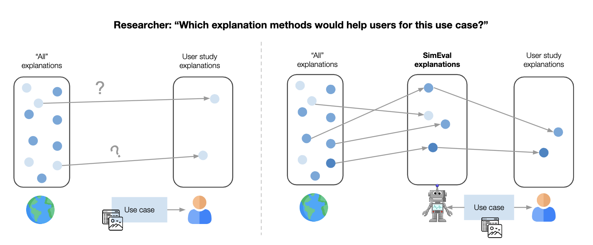

# Use-Case-Grounded Simulated Evaluations

This is a tutorial on how to train **SimEvals**, as presented in "Use-Case-Grounded Simulations for Explanation Evaluation" (NeurIPS 2022) [[pdf]](https://arxiv.org/abs/2206.02256). 

SimEvals measure the predictiveness of information content choices for a downstream use case. When designing a user study, the researcher must identify candidate choices of information content (e.g. which explanation methods, hyperparameters, or other additional baseline information) to evaluate. 


<p align="center">

</p>

Our framework trains a SimEval agent for each choice of information content that the researcher intends to evaluate for a downstream use case. The researcher can then interpret the test set accuracy of each SimEval agent as a measure of the predictiveness of that information content.


In this tutorial, we will use as a running example the counterfactual reasoning use case (as defined in [Kumar et al.](https://arxiv.org/pdf/2002.11097)), which asks whether increasing a certain feature will lead to a corresponding increase in the model's prediction. This running example will evaluate whether the [LIME](https://arxiv.org/abs/1602.04938) explanation for counterfactual reasoning.


## Step 0: Define use-case-specific components

Before training any SimEval agents, we need to define certain use-case-specific components that are shared across all agents:

1. A base dataset on which the explanation method's utility will be evaluated.
2. The base model family, which is the family of prediction models.
3. A function that defines the defines a use case label, which is a ground truth label for the use case. This label corresponds to the correct answer for each question that a user must answer in the user study.

We define use-case-specific components of the counterfactual reasoning use case [here](https://github.com/valeriechen/simeval_tutorial/blob/main/notebooks/Step0_cfreasoning.ipynb).


## Step 1: Data generation 

The goal of this step is to use the researcher’s choice of information
content and use-case-specific components to generate a dataset to train and evaluate the agent. The dataset consists of observation and use case label pairs, where the information content defines what information is included in each observation. 

In this step, generate a dataset that reflects the information presented to a user in a user study, which would include the datapoint, model prediction, and LIME explanation. For more details, see notebook [here](https://github.com/valeriechen/simeval_tutorial/blob/main/notebooks/Step1_cfreasoning.ipynb).


## Step 2: Agent training

After generating a dataset, the researcher trains an algorithmic agent (e.g.,
a machine learning model) to predict the use case label for a given observation. The training process allows the algorithmic agent to implicitly learn relevant domain knowledge about the use case from labeled examples, even when the researcher does not have any knowledge a priori of how to predict the use case labels. 

We show how to train an agent for the generated dataset [here](https://github.com/valeriechen/simeval_tutorial/blob/main/notebooks/Step2_cfreasoning.ipynb).


## Step 3: Agent evaluation

The agent’s accuracy on these examples is a measure of the predictiveness of the information content for the use case: a relative higher accuracy is evidence that a particular type of information content is more useful. We note that the agent’s
performance (i.e. test set accuracy) is not intended to be interpreted as the exact, anticipated human subject’s performance when given the same set of information content as the algorithmic agent. 

This notebook show how to evaluate the agent: [here](https://github.com/valeriechen/simeval_tutorial/blob/main/notebooks/Step3_cfreasoning.ipynb).


## Citing SimEval
If you run your own SimEvals, we encourage you to cite our paper:
```
@inproceedings{
chen2022usecasegrounded,
title={Use-Case-Grounded Simulations for Explanation Evaluation},
author={Valerie Chen and Nari Johnson and Nicholay Topin and Gregory Plumb and Ameet Talwalkar},
booktitle={Advances in Neural Information Processing Systems},
year={2022}
}
```